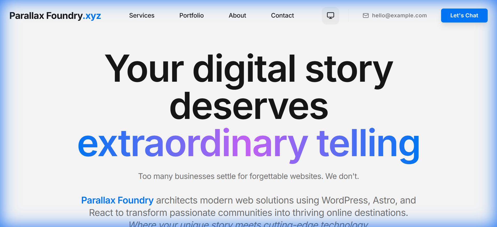

# React Parallax Foundry

An immersive 3D parallax website template powered by React Three Fiber and Framer Motion.

[](./LICENSE)
[](https://react.dev)
[](https://threejs.org)
[](https://docs.pmnd.rs/react-three-fiber)
[](https://www.framer.com/motion)
[](https://vitejs.dev)
[](https://tailwindcss.com)
[](https://www.typescriptlang.org)



> **[Live Demo →](https://parallax-foundry.wpagency.space)**

## Features

- **Three.js 3D scenes with React Three Fiber** - Build immersive 3D environments with declarative React components
- **Drei utilities for 3D helpers** - Pre-built 3D components and utilities for faster development
- **Framer Motion advanced animations** - Powerful sequencing and gesture-driven animation library
- **Luxury/premium component library** - High-end UI components designed for premium experiences
- **Storytelling narrative components** - Pre-built sections for compelling brand narratives
- **20+ Radix UI accessible components** - Accessible, unstyled component primitives
- **shadcn/ui design system** - Modern, copy-paste component library built on Radix UI
- **React Hook Form + Zod validation** - Performant, flexible form validation with TypeScript
- **Dark mode support** - Built-in light and dark theme switching
- **Responsive parallax effects** - Smooth, performance-optimized parallax scrolling on all devices

## Quick Start

```bash
# Clone the repository
git clone https://github.com/wpagency/react-parallax-foundry.git

# Navigate to the project
cd react-parallax-foundry

# Install dependencies
npm install

# Start development server
npm run dev
```

Open [http://localhost:5173](http://localhost:5173) in your browser.

## Tech Stack

| Technology | Purpose |
|-----------|---------|
| React 18.3.1 | UI framework with hooks and concurrent features |
| Three.js 0.179.0 | 3D graphics library for WebGL rendering |
| React Three Fiber 8.18.0 | React renderer for Three.js |
| Drei 9.122.0 | Useful helpers and components for React Three Fiber |
| Framer Motion 12.x | Advanced animation and gesture library |
| Vite 5.4.1 | Next-generation frontend build tool |
| Tailwind CSS 3.4.11 | Utility-first CSS framework |
| TypeScript 5.5.3 | Typed superset of JavaScript |
| Radix UI | Accessible, unstyled component primitives |
| shadcn/ui | High-quality React components |
| React Hook Form 7.x | Performant, flexible form library |
| Zod | TypeScript-first schema validation |

## Project Structure

```
react-parallax-foundry/
├── src/
│   ├── components/        # UI components and layouts
│   ├── pages/             # Route pages
│   ├── three/             # 3D components and scenes
│   ├── luxury/            # Premium UI components
│   ├── storytelling/      # Narrative components
│   ├── hooks/             # Custom React hooks
│   ├── lib/               # Utility functions
│   ├── types/             # TypeScript definitions
│   └── App.tsx            # Main application component
├── public/                # Static assets and screenshots
├── index.html             # HTML entry point
├── vite.config.ts         # Vite configuration
├── tailwind.config.ts     # Tailwind CSS theme config
└── tsconfig.json          # TypeScript configuration
```

## Environment Variables

Copy `.env.example` to `.env.local` and fill in your values:

```bash
cp .env.example .env.local
```

See [.env.example](./.env.example) for all available options.

## Scripts

| Command | Description |
|---------|------------|
| `npm run dev` | Start development server with hot reload |
| `npm run build` | Build for production with optimizations |
| `npm run preview` | Preview production build locally |
| `npm run lint` | Run ESLint to check code quality |
| `npm run type-check` | Check TypeScript types |

## Customization

### Colors and Theme

Edit the color palette in `tailwind.config.ts` or `src/index.css` to match your brand. The theme extends with luxury color variations suitable for premium experiences.

### 3D Scenes

Modify or create new 3D components in `/src/three`. Use React Three Fiber's component syntax to build scenes declaratively:

```tsx
// Example 3D component
import { Canvas } from '@react-three/fiber';
import { OrbitControls, PerspectiveCamera } from '@react-three/drei';

export default function Scene() {
  return (
    <Canvas>
      <PerspectiveCamera makeDefault position={[0, 0, 10]} />
      <mesh>
        <boxGeometry args={[2, 2, 2]} />
        <meshStandardMaterial color="orange" />
      </mesh>
      <OrbitControls />
    </Canvas>
  );
}
```

### Animations

Use Framer Motion for component animations. Update animation variants in component files or create reusable animation definitions:

```tsx
import { motion } from 'framer-motion';

const variants = {
  hidden: { opacity: 0, y: 20 },
  visible: { opacity: 1, y: 0 },
};

export function AnimatedElement() {
  return (
    <motion.div initial="hidden" whileInView="visible" variants={variants}>
      Content
    </motion.div>
  );
}
```

### Content

Update page content in `/src/pages/` and storytelling components in `/src/storytelling/`. Use luxury components from `/src/luxury/` for premium visual effects.

## Other Themes in This Collection

| Theme | Description | Demo |
|-------|------------|------|
| [Astro Brutalfolio](https://github.com/wpagency/astro-brutalfolio) | Brutalist multilingual portfolio | [Demo](https://brutalfolio.wpagency.space) |
| [Astro Romance](https://github.com/wpagency/astro-romance) | Romantic pink agency theme | [Demo](https://astro-romance.wpagency.space) |
| [Astro Starter](https://github.com/wpagency/astro-starter) | Full-featured Astro starter with Three.js | [Demo](https://astro-starter.wpagency.space) |
| [React Agency Genesis](https://github.com/wpagency/react-agency-genesis) | Premium agency funnel template | [Demo](https://agency-genesis.wpagency.space) |
| [React Pulse Robot](https://github.com/wpagency/react-pulse-robot) | WordPress showcase with Lottie | [Demo](https://pulse-robot.wpagency.space) |
| [React Rescue Odyssey](https://github.com/wpagency/react-rescue-odyssey) | Story-driven space theme with Supabase | [Demo](https://rescue-odyssey.wpagency.space) |
| [React Source Seeker](https://github.com/wpagency/react-source-seeker) | Interactive 3D storytelling with PWA | [Demo](https://source-seeker.wpagency.space) |

## Contributing

Contributions are welcome! Please see [CONTRIBUTING.md](./CONTRIBUTING.md) for guidelines.

## License

MIT License — see [LICENSE](./LICENSE) for details.

---

### Built by [WP Agency](https://wpagency.xyz) — WordPress and Beyond

With 15+ years of agency experience, we build production websites that perform. These open-source themes represent our commitment to the developer community.

**Need customization or a production build?** [Let's talk →](https://wpagency.xyz/contact)
